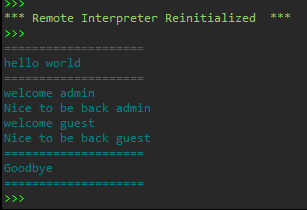
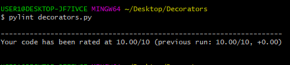

#
# DECORATOR<hr>
- Is a function that modifie other functions.<br>
Sometimes we may need to modify functions in the same way for example, we may
want to perfrm a particular action before and after executing each each of the function,
or pass in an extra parameter or cnvert to another format.

* Here is a good example of how to implement a decorator....*<br>
<br>
<br>

<hr>

- Have implemeted decorator in the folder decorators
- You will require two password

```
1st password = admin

2nd password = guest
```
- To get the correct output<br>

- below are steps that i followed.

<hr>
- To run pylint 

```
 pylint <name of your module>

		pylint decorators.py
```
# STEPS

##step1
- Define a function let us call it decor<br>
```
	def decor():
```

##step2
- Add func in the parathesis.<br>
- We are calling the function to be modified by our decor function.<br>

```
	def decor(func):	

```

##step3
- Let implement our outcome in the function decor<br>
- Let add the following function that will wrap our output<br>

```

    def wrap():
        print("====================")
        func()
        print("====================")
    return wrap
```

- The output should be<br>

```
================
func()
=================

```

##step 4
- let write our function that is to be modified<br>

```
	def print_text():
	   print("Hello world")

```

##step 5
- Let us call our function<br>

```
  def decor(func)
  def wrap():
        print("====================")
        func()
        print("====================")
    return wrap

 def print_text():
    print("Hello world")

print_text()

```

- The output will be <br>

```
	Hello world
```
## step6
- Add our decorator<br>
- Just above our function to be modified lets add<br>

```
	@decor
```

<br><br>
```
def decor(func)
  def wrap():
        print("====================")
        func()
        print("====================")
    return wrap

 @decor
 def print_text():
    print("Hello World!")

print_text()

```

- outcome will be<br>

```
===============

Hello World !
===============

```

# Resources

[Decorators](https://python.org/decorator)
[Pylint](https://python.org/pylint)
#
#